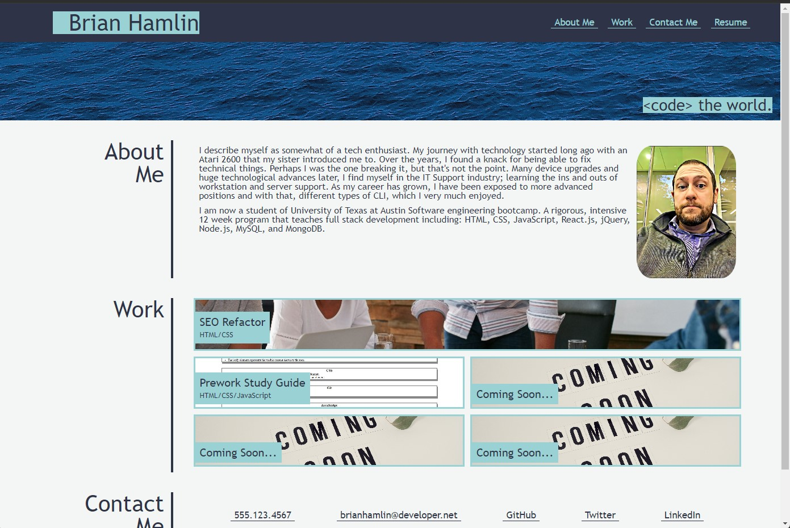

# Portfolio Site

## Table of Contents 
* [Description](#Description) 

* [Usage](#Usage)

* [License](#License) 

* [Contact](#Contact) 

* [Screenshots](#Screenshots) 

### Description
Showcasing various applications built as a collection, for the purposes of showing my work. 

### Usage
Link to live application: https://misterbham.github.io/Porfolio-site/

### License
Further information regarding this specific license can be found via: https://opensource.org/license/mit/.  
 

### Contact
You can contact the developer at: misterbham.dev@gmail.com.  
GitHub: <a href="https://github.com/MisterBham">MisterBham</a>

### Screenshots
